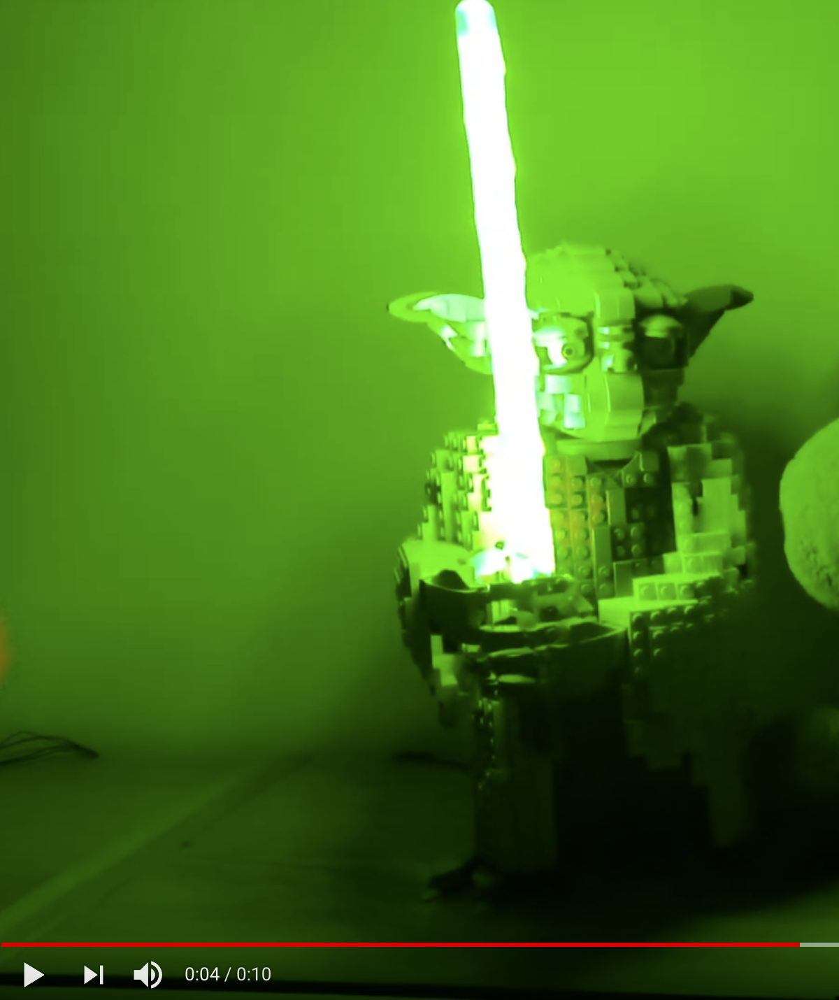

# lego-yoda-lightsaber
Instructable for building LED lightsaber for Lego Yoda 

Based on:
* Arduino Nano
* [TPIC6B595](http://www.ti.com/lit/ds/symlink/tpic6b595.pdf) which is high power serial to parallel converter.

Videos:
* [Breadboard Prototype](https://youtu.be/BCPKu2JhFD4)
* [Drilling the bricks](https://youtu.be/usWitECH5NU)
* [LED's are in](https://youtu.be/l4Xo7qKC0vY)
* [POST check](https://youtu.be/fMXZ4s04P24)
* [Final product](https://youtu.be/NCbAbWCnCWw)

